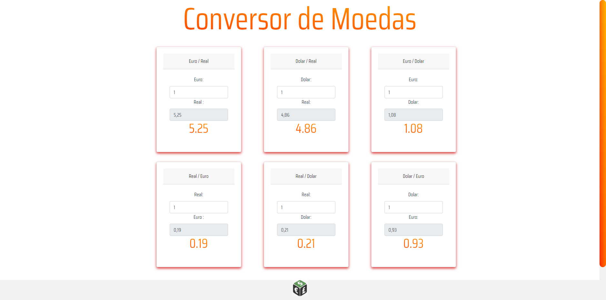

![MOEDAS]

<p align="center"></p>

## Conversor_Moedas-VueJs

Projeto de conversor de moedas utilizando o framework Vue JS.

### Social
* [Whatsapp](https://api.whatsapp.com/send?phone=5521969609121)
* [LinkedIn](https://www.linkedin.com/in/hudsonkennedyjr/)
* [Instagram](https://www.instagram.com/_hudson.9kj/)

## Project setup
```
yarn install or npm install
```

### Compiles and hot-reloads for development
```
yarn run serve or npm run serve 
```

### Compiles and minifies for production
```
yarn build or npm run build
```

### Lints and fixes files
```
yarn lint
```

### Customize configuration
See [Configuration Reference](https://cli.vuejs.org/config/).
